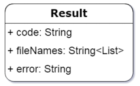

# searcher
Реализовать на <b>Java 1.8+ soap web-service</b>, содержащий в себе метод <b>Result findNumber(Integer number)</b>,
ищущий в 20 разных по составу больших текстовых файлах (каждый должен быть порядка гб.) полученное на
вход число n. Файлы состоят только из чисел, которые разделены между собой запятой. Результат работы
необходимо записать в таблицу БД и вернуть объект <b>Result</b> в вызывающую систему.
Объект <b>Result</b> должен иметь следующую структуру:

где:

атрибут    | расшифровка
-----------|------------------------   
code       | код выполнения программы (коды см. ниже).
fileNames  | имена файлов, в которых удалось найти число.
error      | описание ошибки, в случае её возникновения.

Структура таблицы должна быть следующей:

№ | Name | DataType    | Description
---|------|-------------|-------------------
1  | ID   | NUMBER(*,0) | PK, auto-increment
2  | CODE | VARCHAR2(50 BYTE) | код выполнения программы (коды см. ниже)
3  | NUMBER | NUMBER(*,0) | Число, переданное на вход.
4  | FILENAMES | VARCHAR2(100 BYTE) | имена файлов, в которых удалось найти число
5  | ERROR | VARCHAR2(100 BYTE) | Описание ошибки, в случае её возникновения

Коды выполнения программы, которые необходимо записать в колонку CODE и в поле code объекта Result:

Code | В каком случае используется
-----|--------------------------------------
00.Result.OK | В случае, если число найдено.
01.Result.NotFound | В случае, если число не найдено.
02.Result.Error | В случае, если при выполнении программы возникла ошибка.

# Проблемы и ограничения
1. Поле <b>CODE</b> содержит конкретные значения. Для повышения гибкости
можно моздать таблицу-словарь для этих значений.
2. В БД для списка файлов выделенно 100 символов что налагает ограничение на длинну названия файлов.
(100 символов) / (20 файлов) = (5 символов/файл), примем во внимание символ разделитель (,) в 
итоге название файла не должно превышать 4 символа.
3. На описание ошибки выделенно 100 символов, значит мы не сможем хранить названия файлов при проверке 
которых возникли ошибки.

# Состав дистрибутива
Модуль | Описение
-------|-----------------
generator | содержит код для генерации файлов с случайными числами и размером приблизительно 1Гб (source code)
searcher | реализует сервис поиска в файлах числа и ответов на SOAP запросы
utilites | вспомогательные классы и утилиты

# Используемые инструменты для реализации
1. Maven
1. Spring Framework
1. log4j
1. HSQLDB